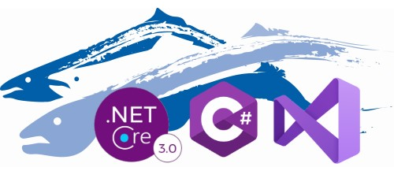

# Salmon King Seafood Reference App (SKS) WinForms C# .NET 3.1



# About the App
Salmon King Seafood (SKS) is a reference App create to show some of the migration capabilities of the [Visual Basic Upgrade Companion](https://www.mobilize.net/visual-basic-upgrade-companion) [VBUC](https://www.mobilize.net/visual-basic-upgrade-companion) from [Mobilize.Net](https://www.mobilize.net)

This repo shows this [VBUC](https://www.mobilize.net/visual-basic-upgrade-companion) sample upgraded to [.NET Core 3.1](https://docs.microsoft.com/en-us/dotnet/core/whats-new/dotnet-core-3-1)

# Upgrading from VB6 to .NETCore 3.1

The [VBUC tool](https://www.mobilize.net/products/app-migrations/vbuc) starting from [version 8.2](https://cdn2.hubspot.net/hubfs/216184/Downloads/VBUC%20Release%20Notes/VBUC%208.2%20Release%20Notes.pdf) supports upgrading your application to .NET Core 3.1.

> NOTE: This application uses OLEDB to access MSACCESS. You can use OleDB on .NETCore 3.1 but some of the drivers are architecture specific. You can download the [Microsoft Access Database Engine 2010 Redistributable](https://www.microsoft.com/en-us/download/details.aspx?id=13255) for 32 or 64. If for example you install the 32 bit version then add:

```xml
  <PropertyGroup Condition="'$(Configuration)|$(Platform)'=='Debug|AnyCPU'">
    <Prefer32Bit>true</Prefer32Bit>
    <PlatformTarget>x86</PlatformTarget>
  </PropertyGroup>
```

# Migrated Screens

You can see some of the [migrated screens here](https://github.com/MobilizeNet/SKSWinForms/#migrated-screens) and read about [some VBUC Features used by this migration](https://github.com/MobilizeNet/SKSWinForms/#some-vbuc-features-used-by-this-migration)

